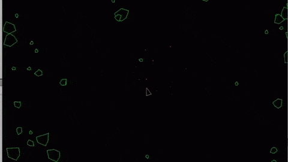

# Not Asteroids

This is a remake inspired by the arcade classic ASTEROIDS. I coded it from 
scratch in plain ol' Java. I wanted some experience building a game without
the help of a game engine. I chose Java because it's easy to work with,
happily cross-platform, and is a language I know well. I chose Asteroids
because I'd never tried a game in this style before.

I've released the source code to the public in hope that other people will
use it to learn some Java game programming and maybe hack on the game to improve
it. If you make improvements, consider contributing them back!

Not Asteroids is distributed under the GPL version 3. See the license file for
the text of this license.

## Building and Running the Game

Not Asteroids is a Netbeans project. It has no external dependencies. Open the
project in Netbeans and click Run!

The game runs fine on Windows, Mac and Linux (Ubuntu) so long as you're using Oracle's
JRE. It seems to run under openjdk as well, but the sound doesn't work properly.
I haven't spent any time trying to debug that and probably won't. 

